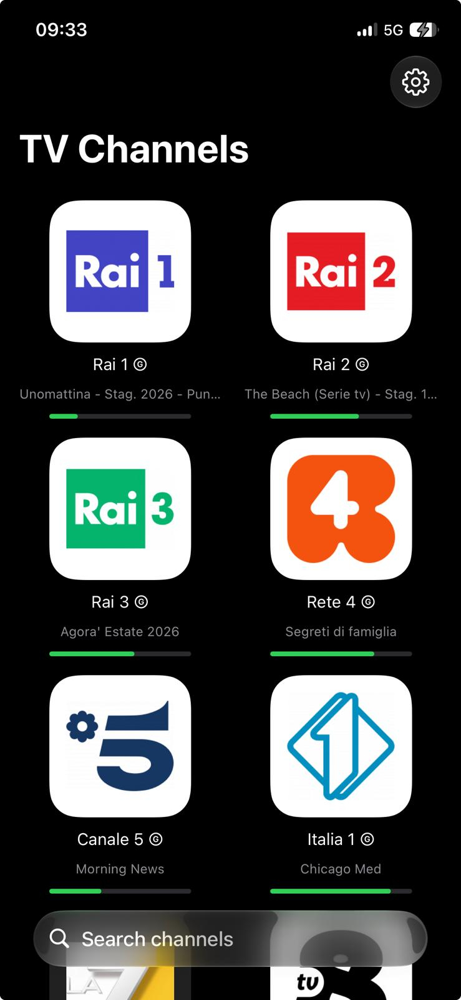
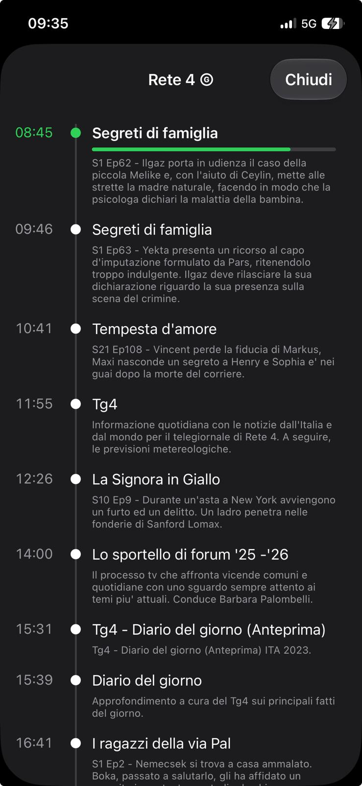
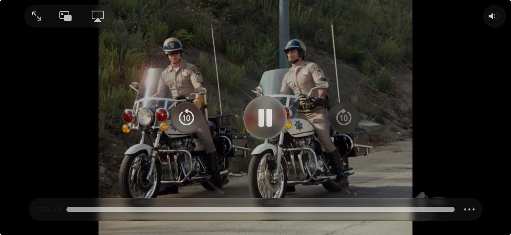

# LimesTV

A lightweight IPTV player for iOS, built with SwiftUI. Browse a grid of live TV
channels, tap to watch, and "zap" between channels with a smooth carousel
transition — with Picture in Picture and CarPlay support.

## Screenshots

| Channel grid | Schedule (palinsesto) | Player (landscape) |
| :---: | :---: | :---: |
|  |  |  |

## Features

- **Channel grid** — adaptive grid of channels with logos, loaded from bundled
  M3U playlists.
- **Search** — filter channels by name.
- **Programme guide (EPG)** — downloads an XMLTV guide on launch (streamed and
  gunzipped off the main thread), shows what's on now on each cell, and a
  timeline schedule per channel. Pull to refresh to re-sync.
- **Channel zapping** — swipe up/down while watching to change channel, with a
  carousel slide transition (the outgoing frame slides out while the new channel
  slides in). Swipe right in landscape to go back.
- **Picture in Picture** — playback continues in a floating window when the app
  is sent to the background.
- **CarPlay** — a channel list (grouped by category) on the car screen; tapping a
  channel switches playback and shows the Now Playing screen. *(Requires the
  CarPlay entitlement — see below.)*
- **Playback preferences** — optional video quality cap (Auto / High / Medium /
  Low) to reduce network and battery use, and a toggle for the zap animation.
  Settings are persisted.
- **Live-stream tuning** — a single reused `AVPlayer`, ready-to-play gating and
  automatic stall recovery for smoother HLS playback.

## Architecture

The app follows a strict **MVVM** structure (one view model per view, logic kept
out of the views) with a shared playback engine:

- **`PlaybackController`** — an app-level service that owns the single `AVPlayer`,
  the channel list and channel zapping. Shared by both the SwiftUI phone player
  and the CarPlay scene, and integrated with `MPNowPlayingInfoCenter` /
  `MPRemoteCommandCenter`.
- **`AppSettings`** — observable, `UserDefaults`-backed user preferences.
- **View models** drive their views; `PlayerViewModel` handles only the phone
  carousel transition and banner, delegating playback to `PlaybackController`.

### Project layout

```
LimesTV/
├── LimesTVApp.swift        # App entry point
├── Info.plist
├── Models/                 # Channel, AppSettings
├── Services/               # PlaylistService, PlaybackController
├── ViewModels/             # One view model per view
├── Views/                  # SwiftUI views + AVPlayerViewController wrapper
├── CarPlay/                # CarPlay scene delegate & coordinator
└── Resources/              # Asset catalog, launch screen, M3U playlists
```

The Xcode project uses **file-system synchronized groups**, so files are included
by their location on disk — no `.pbxproj` edits are needed when adding or moving
files.

## Requirements

- Xcode 26+
- iOS 26+

## Build & Run

1. Open `LimesTV/LimesTV.xcodeproj` in Xcode.
2. Select the `LimesTV` scheme and a device or simulator.
3. Build & run (⌘R).

## CarPlay

The CarPlay UI (channel list + Now Playing) is implemented, but CarPlay requires
an Apple-granted **entitlement** in the provisioning profile to run on a real
head unit. Once granted, add the CarPlay capability in *Signing & Capabilities*.
Roadmap for CarPlay (including video-while-parked support) is in
[`ROADMAP.md`](ROADMAP.md).

## Notes

- The bundled playlists are provided for testing. LimesTV does not host or
  provide any streams; it only plays the URLs found in the configured playlists.
